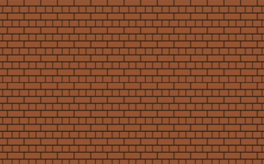



  <!--- Liquid concatentation --->
  <!--- Liquid list variable created from file containing mario metadata for sprite --->
 <!--- Liquid integer assignment --->

  <!--- Liquid concatentation --->
  <!--- Liquid list variable created from file containing mario metadata for sprite --->
 <!--- Liquid integer assignment --->

  <!--- Liquid concatentation --->
  <!--- Liquid list variable created from file containing mario metadata for sprite --->
 <!--- Liquid integer assignment --->

<!--- Liquid concatentation --->
  <!--- Liquid list variable created from file containing mario metatdata for sprite --->
 <!--- Liquid integer assignment --->

<!--- HTML for page contains 
 tag named "mario" and class properties for a "sprite"  -->

 
 
 
 
 
 
 
 

<!--- Embedded Cascading Style Sheet (CSS) rules, defines how HTML elements look --->

<!--- Embedded executable code--->

<!-- # layout: default
# permalink: /cars/
# title: 
# search_exclude: false
# toc: false
# categories: [] -->

<html>
<body>

<!--  -->
<!-- The image has scrolling behavior to left -->
<!-- <marquee  behavior="scroll" direction="right">        
     
        
</marquee> -->
<!--           -->

</body>
</html>

<html>
<head>
    
</head>
<body>
        

        

        

        

        <!-- 

 -->
        <!-- 

 -->
    </body>
</html>

<footer>

</footer>